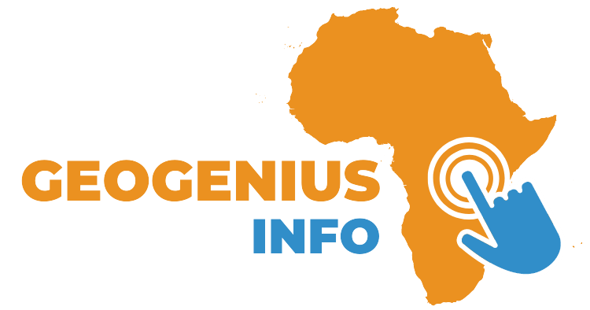

# 

Explore the information, name, capital, and flag of each country with just a click on a world map. <a href="https://geogenius-two.vercel.app/">Try it out now!</a>

## Background

I'm not very good at remembering countries' names and their positions, and I haven't had a chance to work on mapping components in frontend yet. That's why I came up with a small project working with mapping components that can help people who has the same issue like me memorize countries better!

## Feature

- Clicking on any country on a map to fetch information about that country

## Built with

- [Next.js 14](https://nextjs.org/) - Development environment
- [Tailwind CSS](https://tailwindcss.com/) - CSS framework
- [Next UI](https://nextui.org/) - Components library for User Interface

## Data Sources

- [Simple Map](https://simplemaps.com/resources/svg-maps) - Map SVG
- [Rest Countries API](https://restcountries.com/) - Fetching country data
- [React Zoom Pan Pinch](https://www.npmjs.com/package/react-zoom-pan-pinch) - Built a zoomable container

## What's next

You can make use of this in many different ways, using it to visualize global data as you please, as long as you can find a suitable API or even build one yourself. There are some libraries that you could use instead of assigning events in an SVG tag like I did. [React Simple Map](https://www.react-simple-maps.io/) is another interesting choice if you plan to work on a similar project.

## Author
Phot Koseekrainiramon
- [LinkedIn](https://www.linkedin.com/in/phot-kosee/)
- [GitHub](https://github.com/photkosee)

## Contributing

Pull requests are welcome. Please open an issue first to discuss what'd like to improve.
